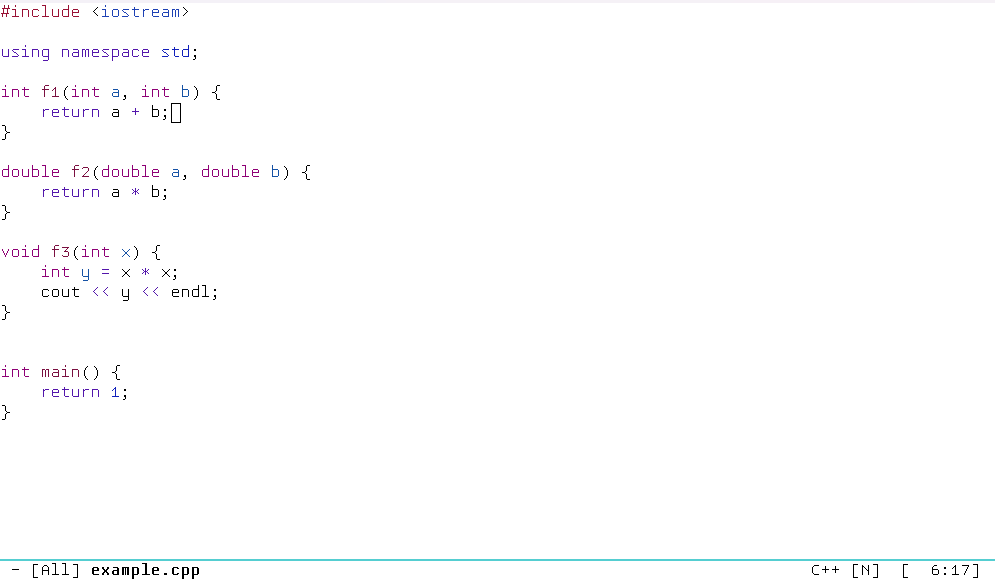

[](https://melpa.org/#/symbols-outline)
# Introduction

This package displays all the symbols (including classes, functions, variables, etc., depending on what the backend outputs), in an outline view.

# Features

1. List the symbols in a well-organized window.
2. The outline window position follows your cursor in the original buffer.
3. It's easy to navigate between symbols via moving in the outline window.
4. Allows various and custom backends. Currently ctags and lsp-mode/eglot backends are provided.

# Demo



# Requirements

Symbols-outline.el relies on a backend to get the symbols. By default the ctags backend is used. Or if `lsp-mode` or `eglot` is active, you can use the lsp backend. See `symbols-outline-fetch-fn`.

If using ctags backend, `universal-ctags` must be installed on your machine.

# Installation

This package is in Melpa so you can install it with your favorite package manager.

# Example configuration

``` emacs-lisp
(use-package symbols-outline
  :ensure t
  :bind ("C-c i" . symbols-outline-show)
  :init
  (add-hook 'lsp-mode-hook ; Or `eglot-mode-hook' 
            (lambda ()
              (setq-local symbols-outline-fetch-fn #'symbols-outline-lsp-fetch)))
  :config
  (setq symbols-outline-window-position 'left)
  (symbols-outline-follow-mode))
```

# Keybindings in the outline window

| Key   | Command                                   | Description                                                                       |
|:------|:------------------------------------------|:----------------------------------------------------------------------------------|
| g     | symbols-outline-refresh                   | Refresh                                                                           |
| q     | quit-window                               | Close the outline window                                                          |
| n     | symbols-outline-next                      | Move to the next symbol                                                           |
| p     | symbols-outline-prev                      | Move to the previous symbol                                                       |
| f     | symbols-outline-next-same-level           | Move to the the next symbol of the same level                                     |
| b     | symbols-outline-prev-same-level           | Move to the the previous symbol of the same level                                 |
| u     | symbols-outline-move-depth-up             | Move to the the parent symbol                                                     |
| d     | symbols-outline-move-depth-down           | Move to the the child symbol                                                      |
| TAB   | symbols-outline-toggle-node               | Fold/unfold the children symbols                                                  |
| S-TAB | symbols-outline-cycle-visibility-globally | Fold/unfold globally                                                              |
| RET   | symbols-outline-visit                     | Go to the symbol under cursor in the original buffer                              |
| M-RET | symbols-outline-visit-and-quit            | Go to the symbol under cursor in the original buffer and close the outline window |

# Customizations

- `symbols-outline-window-position`: the outline window position. Default `right`.
- `symbols-outline-window-width`: the outline side window width. Default `30`.
- `symbols-outline-no-other-window`: if `t`, the outline side window will not be selected with the `other-window` command. Instead, you can switch to the outline window with `symbols-outline-show`. Default `t`.
- `symbols-outline-no-delete-other-window`: if `t`, the outline side window will not be deleted by the `delete-other-windows` command. Default `t`.
- `symbols-outline-use-nerd-icon-in-gui`: whether to use nerd icons instead of SVGs in GUI Emacs.
- `symbols-outline-ignore-variable-symbols`: whether to ignore variable nodes. Default `t`.
- `symbols-outline-collapse-functions-on-startup`: whether to collapse function nodes on startup to hide the parameter nodes.
- `symbols-outline-initial-folded-node-kinds`: kinds of nodes that will be folded on startup. Check out the variable `symbols-outline--kind-face-alist` for available node kinds.
- `symbols-outline-format-symbol-name-p`: whether to format symbol names in the outline window. Default `t`. This turns on displaying e.g. `LongClassName::func` as `L::func`.
